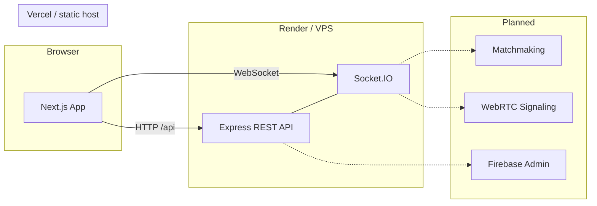

# Seegiri

**Repository:** `seegiri-random-video-chat-platform`

A production-oriented platform for serendipitous, privacy-conscious video conversations. Seegiri pairs strangers for high-definition video chats with a warm, trust-first experience -built as a split-stack monorepo so the web app and realtime API can scale and deploy independently.

---

## Overview

Seegiri is designed to feel less like a roulette wheel and more like a digital lounge: verified profiles, real-time safety tooling, and end-to-end encrypted feeds (planned). This repository contains the full stack -marketing site, chat surface, admin shell, and the Node.js backend that will power matchmaking and WebRTC signaling.

The codebase is delivered in **phases**. Phase 1 established strict TypeScript, linting, environment validation, SEO primitives, and UI architecture. Later phases add the premium landing experience, matchmaking, peer video, chat controls, and Firebase-backed admin tools.

## Features

| Area                  | Status      | Description                                                                 |
| --------------------- | ----------- | --------------------------------------------------------------------------- |
| Landing page          | In progress | Premium marketing site with motion, safety messaging, and CTA into chat     |
| Chat shell            | Scaffold    | Route, layout, and metadata contracts for the realtime experience           |
| Admin shell           | Scaffold    | Protected surface for moderation and user management (Phase 7)              |
| REST API              | Live        | Express health endpoint with security headers, CORS, and structured logging |
| Socket.IO             | Live        | WebSocket server attached to the API; ready for matchmaking events          |
| Matchmaking           | Planned     | Queue-based pairing (Phase 3)                                               |
| WebRTC                | Planned     | Peer video with signaling over Socket.IO (Phase 4–5)                        |
| Firebase Auth / Admin | Planned     | Client auth and server-side admin SDK (Phase 7)                             |

## Tech stack

### Frontend (`frontend/`)

- **Next.js 16** (App Router) · **React 19** · **TypeScript**
- **Tailwind CSS 4** with a custom design-token theme
- **Framer Motion** for landing-page animation
- **Zustand** for client state · **Zod** for env validation
- **Socket.IO client** · **Firebase** (client SDK, optional until auth ships)
- **react-hook-form** · **Lucide React** icons

### Backend (`backend/`)

- **Node.js 20+** · **Express 5** · **TypeScript** (ESM)
- **Socket.IO 4** for realtime transport
- **Firebase Admin** (optional, Phase 7)
- **Helmet**, **CORS**, **Morgan** -security headers, origin allowlists, request logging
- **Zod** for environment validation at boot

### Tooling (repository root)

- **Prettier** + **prettier-plugin-tailwindcss**
- **Husky** + **lint-staged** -format on commit, lint via pre-commit hook
- **ESLint 9** (flat config) in both workspaces

## Architecture



**Default local URLs**

| Service      | URL                                                   |
| ------------ | ----------------------------------------------------- |
| Web app      | `http://localhost:3000`                               |
| REST API     | `http://localhost:4000/api`                           |
| Health check | `http://localhost:4000/api/health`                    |
| Socket.IO    | `http://localhost:4000` (same HTTP server as the API) |

## Project structure

```
.
├── frontend/                 # Next.js web application
│   ├── src/
│   │   ├── app/              # App Router pages (/, /chat, /admin)
│   │   ├── components/       # UI, layout, landing, chat
│   │   ├── config/           # Site metadata and SEO helpers
│   │   ├── firebase/         # Client Firebase initialization
│   │   ├── hooks/            # Shared React hooks
│   │   ├── lib/              # Utilities, env parsing, errors
│   │   ├── services/         # HTTP client and API layer
│   │   ├── socket/           # Socket.IO client config
│   │   ├── store/            # Zustand stores
│   │   ├── styles/           # Global theme and landing CSS
│   │   ├── types/            # Shared TypeScript types
│   │   └── webrtc/           # WebRTC module boundary (Phase 4+)
│   └── public/               # Static assets
│
├── backend/                  # Node.js realtime API
│   └── src/
│       ├── config/           # Env, logger, Firebase Admin
│       ├── controllers/      # Route handlers (extensible)
│       ├── matchmaking/      # Matchmaking module (Phase 3)
│       ├── middlewares/      # CORS, security, body parsing, logging
│       ├── routes/           # Express routers
│       ├── services/         # Business logic layer
│       ├── socket/           # Socket.IO server setup
│       └── types/            # Shared backend types
│
├── .husky/                   # Git hooks
├── package.json              # Root scripts (lint, format, prepare)
└── README.md
```

## Prerequisites

- **Node.js 20+** and **npm**
- (Optional) A Firebase project -only required when auth/admin features are enabled

## Getting started

### 1. Clone and install

```bash
git clone https://github.com/<your-org>/seegiri-random-video-chat-platform.git
cd seegiri-random-video-chat-platform

npm install
npm install --prefix frontend
npm install --prefix backend
```

### 2. Configure environment

**Frontend** -copy the template and adjust if needed:

```bash
cp frontend/.env.example frontend/.env.local
```

**Backend** -copy the template:

```bash
cp backend/.env.example backend/.env
```

On Windows (PowerShell):

```powershell
Copy-Item frontend\.env.example frontend\.env.local
Copy-Item backend\.env.example backend\.env
```

### 3. Run locally

Open two terminals:

```bash
# Terminal 1 -web app
cd frontend && npm run dev

# Terminal 2 -API + Socket.IO
cd backend && npm run dev
```

Visit [http://localhost:3000](http://localhost:3000). Confirm the API with [http://localhost:4000/api/health](http://localhost:4000/api/health).

## Environment variables

### Frontend (`frontend/.env.local`)

| Variable                   | Required | Default (local)             | Purpose                                    |
| -------------------------- | -------- | --------------------------- | ------------------------------------------ |
| `NEXT_PUBLIC_APP_URL`      | No       | `http://localhost:3000`     | Canonical site URL for SEO and metadata    |
| `NEXT_PUBLIC_API_BASE_URL` | No       | `http://localhost:4000/api` | REST API base path                         |
| `NEXT_PUBLIC_SOCKET_URL`   | No       | `http://localhost:4000`     | Socket.IO server origin                    |
| `NEXT_PUBLIC_FIREBASE_*`   | No       | -                           | Firebase client config (auth/admin phases) |

All `NEXT_PUBLIC_*` values are validated at build time via Zod in `frontend/src/lib/env.ts`.

### Backend (`backend/.env`)

| Variable                 | Required | Default                 | Purpose                                            |
| ------------------------ | -------- | ----------------------- | -------------------------------------------------- |
| `NODE_ENV`               | No       | `development`           | Runtime mode                                       |
| `PORT`                   | No       | `4000`                  | HTTP listen port                                   |
| `LOG_LEVEL`              | No       | `info`                  | `debug` · `info` · `warn` · `error`                |
| `SEEGIRI_PUBLIC_ORIGINS` | No       | `http://localhost:3000` | Comma-separated CORS and Socket.IO allowed origins |
| `FIREBASE_PROJECT_ID`    | No       | -                       | Firebase Admin (Phase 7)                           |
| `FIREBASE_CLIENT_EMAIL`  | No       | -                       | Service account email                              |
| `FIREBASE_PRIVATE_KEY`   | No       | -                       | Service account private key                        |

Invalid backend env vars cause the process to exit on startup with a clear validation error.

## Scripts

### Repository root

| Command                | Description                           |
| ---------------------- | ------------------------------------- |
| `npm run lint`         | ESLint across frontend and backend    |
| `npm run format`       | Prettier write on all supported files |
| `npm run format:check` | Prettier check (CI-friendly)          |

### Frontend (`frontend/`)

| Command             | Description              |
| ------------------- | ------------------------ |
| `npm run dev`       | Start Next.js dev server |
| `npm run build`     | Production build         |
| `npm run start`     | Serve production build   |
| `npm run lint`      | ESLint (zero warnings)   |
| `npm run typecheck` | `tsc --noEmit`           |

### Backend (`backend/`)

| Command             | Description            |
| ------------------- | ---------------------- |
| `npm run dev`       | Start with `tsx watch` |
| `npm run build`     | Compile to `dist/`     |
| `npm run start`     | Run compiled output    |
| `npm run lint`      | ESLint (zero warnings) |
| `npm run typecheck` | `tsc --noEmit`         |

## Quality gates

Pre-commit hooks (Husky) run **lint-staged** (Prettier) and **`npm run lint`**. Run checks manually before pushing:

```bash
npm run format:check
npm run lint
npm run typecheck --prefix frontend
npm run typecheck --prefix backend
```

## Deployment

### Frontend → Vercel (recommended)

1. Import the `frontend/` directory as a Vercel project (or set root to `frontend`).
2. Set all required `NEXT_PUBLIC_*` variables in the Vercel dashboard.
3. Point `NEXT_PUBLIC_API_BASE_URL` and `NEXT_PUBLIC_SOCKET_URL` at your deployed backend.

### Backend → Render / VPS

1. Build: `npm run build --prefix backend`
2. Start: `npm run start --prefix backend`
3. Set `SEEGIRI_PUBLIC_ORIGINS` to your production web origin(s), comma-separated if you have staging and production.
4. Ensure the host exposes WebSocket upgrades on the same port as the HTTP server.

**Example production origins**

```env
SEEGIRI_PUBLIC_ORIGINS=https://seegiri.app,https://www.seegiri.app
```

## Roadmap

| Phase   | Focus                                                              |
| ------- | ------------------------------------------------------------------ |
| **1** ✓ | Foundation -TypeScript, lint/format, env validation, SEO, UI shell |
| **2**   | Premium landing page (in progress)                                 |
| **3**   | Realtime matchmaking queue                                         |
| **4–5** | WebRTC peer video and in-call controls                             |
| **6**   | Chat UX polish -skip, report, reconnect                            |
| **7**   | Firebase-backed auth, profiles, and admin moderation               |

## License

Private -all rights reserved unless otherwise specified by the repository owner.
